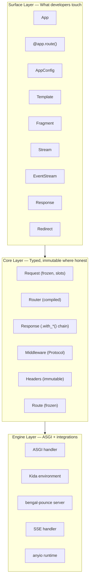
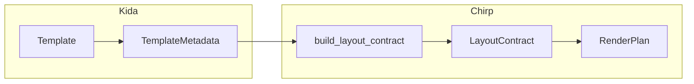
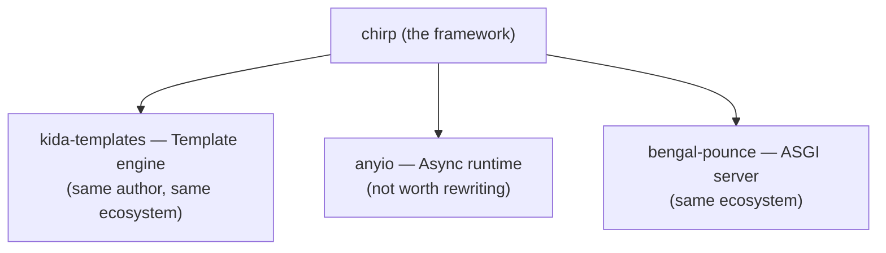

This page is the mental map of how Chirp is built — the three layers a request passes through, where each module lives, and how a template becomes rendered HTML. It's for contributors and anyone evaluating the design; you never need to read it to *use* Chirp.

Chirp is a {gterm}`Hypermedia` framework: the server sends HTML with controls and links, and the client swaps fragments instead of owning application state.

If you just want to build something, start with [[docs/get-started/quickstart|the quickstart]].

:::{note}
Everything below the Surface layer is internal machinery. You never construct Core or Engine types directly — Chirp builds them for you from your routes, templates, and config.
:::

## Three Layers

Chirp is organized into three layers, each with a clear responsibility:



:::{list-table}
:header-rows: 1

* - Layer
  - Responsibility
  - Do you touch it?
* - **Surface**
  - The API you write against: `@app.route()` decorators, return types (`Template`, `Fragment`, `Stream`), and the frozen `AppConfig`.
  - Yes — this is the whole developer surface.
* - **Core**
  - Typed, immutable data: `Request` is `@dataclass(frozen=True, slots=True)`, `Response` chains `.with_*()` transforms, the router compiles to an immutable trie, middleware is a Protocol (not a base class).
  - Rarely — you read a `Request`, return a `Response`, and write middleware to the Protocol.
* - **Engine**
  - The ASGI handler bridging raw scope/messages to typed abstractions, the Kida environment, and the `bengal-pounce` ASGI server.
  - No — Chirp drives it for you.
:::

The frozen/slots design and the `ContextVar` request state are what make Chirp safe under free-threading. See [[docs/about/thread-safety|free-threading and frozen state]] for why.

:::{glossary}
:tags: architecture, concepts, docs
:sorted:
:show-tags:
:collapsed:
:::

## Module Layout

:::{dropdown} Full module map
The tree below is the package layout as it ships in [`src/chirp/`](https://github.com/lbliii/chirp). It's reference detail — you can build anything in Chirp without it.

```
chirp/
├── __init__.py          # Public API exports (lazy imports)
├── app/                 # App class and setup
├── config.py            # AppConfig frozen dataclass
├── context.py           # Request-scoped context (ContextVar, g)
├── contracts/           # app.check() rule set (checker + rules_*.py)
├── errors.py            # Error hierarchy
├── sources.py           # Template source loading
├── domains.py           # Domain/host routing
├── freeze.py            # The freeze transition (mutable → immutable)
├── plugin.py            # Plugin registration
├── health.py            # Health-check endpoints
├── resilience.py        # Timeouts, retries, circuit breaking
│
├── _internal/           # ASGI type definitions (not public)
├── http/                # Request, Response, Headers, Cookies, Query, Forms
├── routing/             # Router, Route, path parameters
├── middleware/          # Protocol, CORS, StaticFiles, Sessions, Auth, CSRF
├── templating/          # Kida integration, return types, filters, streaming
├── pages/
│   └── reactive/        # ReactiveBus, DependencyIndex, reactive_stream
├── realtime/            # SSE protocol and EventStream
├── server/              # ASGI handler, dev server, content negotiation
├── data/                # Database access, row mapping
├── security/            # Decorators, password hashing
├── validation/          # Form validation rules and results
├── cache/               # Response and fragment caching
├── i18n/                # Internationalization
├── markdown/            # Markdown rendering (patitas)
├── cli/                 # chirp CLI (new, run, check, freeze)
├── docs/                # In-framework docs tooling
├── ext/                 # Extensions (e.g. chirp-ui integration)
├── testing/             # TestClient, assertions, SSE testing
├── tools/               # MCP tool registry and handler
└── ai/                  # LLM integration (optional)
```
:::{/dropdown}

## Request Flow

A request flows through the system like this:

:::{steps}
:::{step} ASGI handler receives scope and messages

Raw ASGI scope and message stream enter the engine layer.

:::{/step}
:::{step} Request construction

Frozen dataclass created from ASGI scope.

:::{/step}
:::{step} Middleware pipeline

Each middleware wraps the next; request passes through the stack.

:::{/step}
:::{step} Router matches path

Trie lookup matches path to handler.

:::{/step}
:::{step} Handler invocation

Signature introspection injects Request + path params.

:::{/step}
:::{step} Return value

Handler returns a value (Template, Fragment, etc.).

:::{/step}
:::{step} Content negotiation

Return type determines how to render the response.

:::{/step}
:::{step} Response sending

ASGI messages sent back to the server.

:::{/step}
:::{/steps}

## Template Rendering Flow

Chirp uses Kida's AST metadata for OOB discovery and block validation:



:::{note} See also

[[docs/build-apps/html-fragments/kida-integration|Kida Integration]] walks the full template-to-HTML flow, and [[docs/build-apps/request-pipeline/render-plan|the RenderPlan / render pipeline]] covers how a `RenderPlan` drives OOB discovery and block validation.
:::

## Dependencies

Chirp owns the developer interface and delegates commodity infrastructure:



Optional extras add focused capabilities without bloating the core. SQLite needs no extra — Chirp uses the stdlib `sqlite3`.

```
chirp[forms]      → python-multipart  (form/multipart parsing)
chirp[sessions]   → itsdangerous      (signed session cookies)
chirp[auth]       → argon2-cffi       (password hashing)
chirp[testing]    → httpx             (test client)
chirp[data-pg]    → asyncpg           (PostgreSQL)
chirp[markdown]   → patitas[syntax]   (markdown rendering)
chirp[ai]         → httpx             (LLM streaming)
chirp[all]        → everything above
```

See [[docs/get-started/installation|installation and extras]] for the full list and install commands.

## Next Steps

- [[docs/about/philosophy|Philosophy]] -- Design principles
- [[docs/about/thread-safety|Thread Safety]] -- Free-threading patterns
- [[docs/about/core-concepts/app-lifecycle|App Lifecycle]] -- The freeze transition
