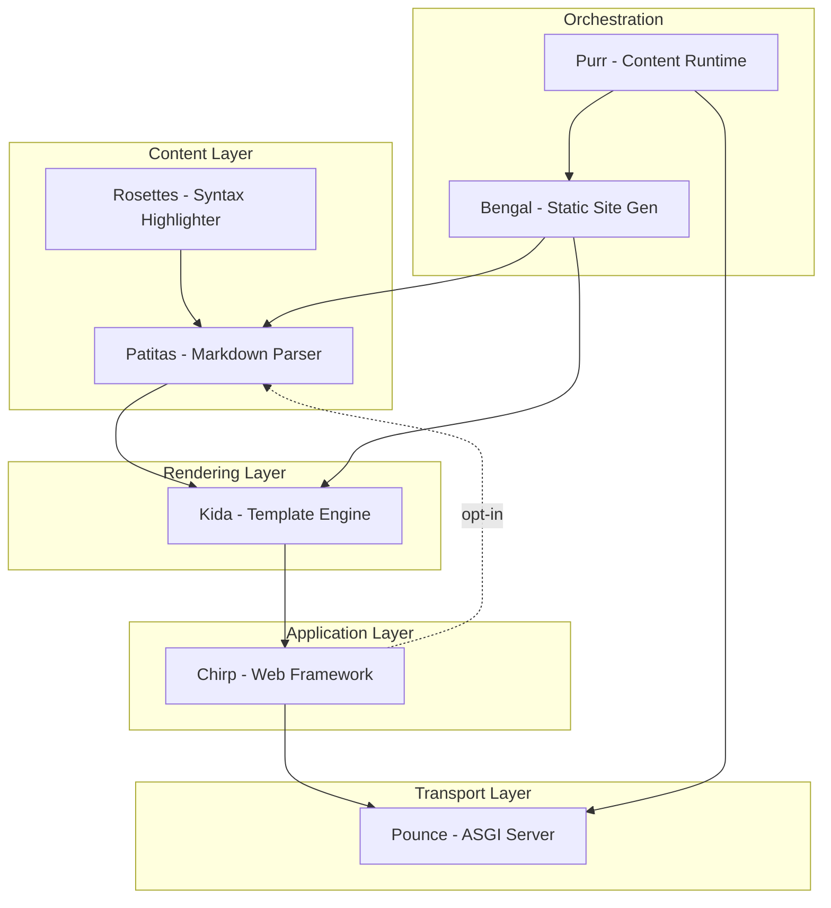

# The Bengal Ecosystem

Chirp is one layer of a larger set of small, single-purpose Python packages by the
same author — collectively the **Bengal ecosystem**. Every layer is pure Python with
no Node/npm build step, and all are built for Python 3.14t free-threading.

You don't need to learn any of them to use Chirp. It pulls in only what it needs: the
[Kida](https://github.com/lbliii/kida) template engine and the
[Pounce](https://github.com/lbliii/pounce) ASGI server by default, and the
[Patitas](https://github.com/lbliii/patitas) markdown parser (with its
[Rosettes](https://github.com/lbliii/rosettes) highlighter) only when you opt into
markdown rendering. This page maps the stack so you can see where Chirp sits and where
to go for each piece.

:::{note}
**What Chirp installs out of the box:** `kida-templates` (template engine) and
`bengal-pounce` (ASGI server). Markdown rendering is opt-in — `pip install
chirp[markdown]` pulls in `patitas[syntax]`, which brings Rosettes transitively. The
rest of the ecosystem (Bengal, Purr) are separate tools you install only if you need
them.
:::

## The packages

::::{cards}
:columns: 2
:gap: medium

:::{card} Bengal
:icon: cube
:link: https://lbliii.github.io/bengal/
Static site generator. Builds these docs.
:::{/card}

:::{card} Purr
:icon: layers
:link: https://github.com/lbliii/purr
Content runtime (ecosystem framing — not used by Chirp).
:::{/card}

:::{card} Chirp
:icon: rocket
:link: https://lbliii.github.io/chirp/
Web framework — you are here.
:::{/card}

:::{card} Pounce
:icon: server
:link: https://lbliii.github.io/pounce/
ASGI server. A default Chirp dependency.
:::{/card}

:::{card} Kida
:icon: file-text
:link: https://lbliii.github.io/kida/
Template engine. A default Chirp dependency.
:::{/card}

:::{card} Patitas
:icon: file-text
:link: https://lbliii.github.io/patitas/
Markdown parser. Opt-in via `chirp[markdown]`.
:::{/card}

:::{card} Rosettes
:icon: shield
:link: https://lbliii.github.io/rosettes/
Syntax highlighter. Arrives transitively with Patitas.
:::{/card}

::::{/cards}

Chirp uses Kida directly for every render; see [[docs/build-apps/html-fragments/kida-integration|Kida integration]]
for how templates, blocks, and fragments fit together. For how Chirp itself is layered,
see [[docs/about/architecture|how Chirp is layered internally]].

::::{dropdown} How the layers depend on each other
:icon: layers

Solid edges are baseline dependencies; the dashed `Chirp ⇢ Patitas` edge is the
opt-in markdown extra (`chirp[markdown]`). Purr's edges reflect the ecosystem's own
framing — Chirp does not use Purr.
::::{/dropdown}

Python-native. Free-threading ready. No npm required. Ready to build? [[docs/get-started/quickstart|Try the quickstart]].
