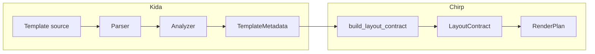

# Kida Integration

Kida is Chirp's template engine. At build time it hands Chirp the structure of
each template — its block names, its regions, and which context keys each block
reads. Chirp reads that structure instead of hard-coding which blocks exist,
which is how [[docs/build-apps/html-fragments/fragments|fragment]] rendering,
out-of-band (OOB) regions, and layout contracts work with no framework-specific
config.

You rarely touch any of this directly. To add an OOB region you write a
`` block in your layout and register its DOM target;
Chirp discovers the rest. This page explains that discovery so you can add your
own regions and reason about what gets rendered.

:::{note}
This is an internals page. If you just want to render OOB fragments, start with
[[docs/build-apps/html-fragments/fragments|Fragments]] and the
[[docs/quality/contracts-debugging/oob-registry|OOB registry]] — they cover the
public API. Come back here when you want to know *how* the discovery works.
:::

## Add an OOB region

An OOB region is a layout block whose name ends in `_oob`. Chirp finds every
such block, renders it as an out-of-band swap on boosted navigation, and targets
it at a DOM element by id. Adding one is two steps.

::::{steps}
:::{step} Write the region in your layout
A `` block compiles to two things at once: a named block
Chirp can render in isolation, and a callable you invoke from a shell slot. Name
it with the `_oob` suffix so discovery picks it up.

```html

  {{ sidebar(current_path=current_path) }}

```
:::{/step}

:::{step} Register its DOM target
Tell Chirp which element id the region replaces:

```python
app.register_oob_region("sidebar_oob", target_id="sidebar-nav")
```

If you skip registration, Chirp falls back to a convention: it strips the `_oob`
suffix, so `sidebar_oob` targets the element with `id="sidebar"`. Register
explicitly when the id does not match that convention.
:::{/step}
::::{/steps}

That's the whole task. The
[[docs/quality/contracts-debugging/oob-registry|OOB registry]] page documents
`register_oob_region` options (`swap`, `wrap`, `optional`) and the fail-loud
policy in full.

:::{warning}
There is no internal map of region names to target ids that you edit. Targets
come from one of two places only: the `target_id` you pass to
`register_oob_region`, or the `block_name.removesuffix("_oob")` convention when
a block is unregistered. Reach for the public API; don't go looking for a
constant to patch.
:::

ChirpUI registers three regions for you when you load its app shell —
`breadcrumbs_oob`, `sidebar_oob`, and `title_oob`, mapped to
`chirpui-topbar-breadcrumbs`, `chirpui-sidebar-nav`, and
`chirpui-document-title`. See [[docs/build-apps/ui-extensions/app-shell|App
Shells]] for regions in practice.

## Why regions beat plain blocks

Kida's `` compiles to BOTH a renderable block (for OOB updates) and
a callable (for `{{ name(args) }}` in shell slots). One definition serves both,
so you don't duplicate the markup:

- **Renderable** — Chirp renders the block on its own for an OOB swap.
- **Callable** — you invoke `{{ sidebar_oob(current_path=...) }}` inside a slot.
- **Parameterized** — `` makes the
  region self-contained; the same defaults apply whether it renders as a slot or
  as an OOB update.

The `examples/chirpui/shell_oob` reference layout defines and calls a region in
one place:

```html

{{ breadcrumbs(breadcrumb_items) }}

```

*Source: [`examples/chirpui/shell_oob/pages/_layout.html`](https://github.com/lbliii/chirp/blob/main/examples/chirpui/shell_oob/pages/_layout.html).*

```html

  
  {{ breadcrumbs_oob(breadcrumb_items=breadcrumb_items ?? [{"label":"Home","href":"/"}]) }}
  
```

*Source: [`examples/chirpui/shell_oob/pages/_layout.html`](https://github.com/lbliii/chirp/blob/main/examples/chirpui/shell_oob/pages/_layout.html).*

## Migrate a block to a region

If your layout uses a plain `` and duplicates the same markup
in a shell slot, collapse it to a single region.

:::{tab-set}
:::{tab-item} Before: block + duplication
```html

  {{ breadcrumbs(breadcrumb_items) }}



  
    {{ breadcrumbs(breadcrumb_items) }}  {# duplicated #}
  

```

The OOB block and the slot render the same content from two copies. They drift.
:::{/tab-item}

:::{tab-item} After: one region
```html

  {{ breadcrumbs(breadcrumb_items) }}



  
    {{ breadcrumbs_oob(breadcrumb_items=breadcrumb_items ?? [{"label":"Home","href":"/"}]) }}
  

```

One definition; the slot calls the region. No duplication, no drift.
:::{/tab-item}
:::{/tab-set}

Then remove any empty `_page_layout` block overrides you added to suppress the
OOB block on full-page renders — Chirp already suppresses OOB output on full-page
responses through its block overrides, so those workarounds are no longer needed.

:::{note} See also
- [[docs/build-apps/html-fragments/layout-patterns|Layout composition]] — the block-vs-region authoring story
- [[docs/build-apps/ui-extensions/app-shell|App Shells]] — OOB regions wired into a real shell
:::

## How discovery and validation work

Most readers stop above. The rest of this page is the mechanism for the curious.

:::{dropdown} The pipeline: template source to layout contract
Chirp never loads a template at request time to learn its shape. It reads Kida's
structural metadata at build time and caches a contract.



1. **Template source** → Kida parses and analyzes the AST.
2. **TemplateMetadata** → blocks, regions, and per-block `depends_on` /
   `cache_scope`.
3. **`build_layout_contract()`** → finds the `*_oob` blocks (preferring
   region-typed ones via `regions()`), resolves each target id, and records its
   `cache_scope` and `depends_on`.
4. **LayoutContract** → cached per template; drives which OOB blocks render on
   boosted navigation.

For how this contract feeds the wider render plan, see
[[docs/build-apps/request-pipeline/render-plan|the render plan]].
:::{/dropdown}

:::{dropdown} When Chirp skips an OOB block
While building region updates, Chirp skips an OOB block in two cases:

- The block is **site-scoped and has no dependencies** (`cache_scope == "site"`
  *and* `depends_on` is empty). It's static — the same on every page — so there's
  nothing to swap. A site-scoped block that *does* read context still renders.
- The block depends on `page_title` but `page_title` isn't in the layout
  context, so there's nothing to render.

Both prevent emitting OOB chunks that would do no useful work.
:::{/dropdown}

:::{dropdown} Block validation in debug mode
When `validate_blocks` is on — Chirp turns it on automatically in `debug=True`
mode — Chirp checks that a requested block exists in the template's metadata
before rendering, instead of failing deep in the render. A missing block raises
`chirp.errors.BlockNotFoundError`:

```python
from chirp.errors import BlockNotFoundError

raise BlockNotFoundError(template=view.template, block=view.block)
```

`BlockNotFoundError` multi-inherits from `KeyError`, so existing
`except KeyError:` handlers still catch it. The check reads `meta.blocks` from
the cached metadata — no runtime template load. The same fail-loud policy
governs OOB region misses; see
[[docs/quality/contracts-debugging/oob-registry|the OOB registry]].
:::{/dropdown}

:::{dropdown} Metadata fields Chirp reads, and the adapter contract
Chirp consumes these fields from Kida's `TemplateMetadata`:

| Field | Chirp use |
|-------|-----------|
| `blocks` | Block existence checks and `*_oob` discovery |
| `regions()` | Prefer region-typed blocks for OOB discovery |
| `depends_on` | Skip an OOB block when its required context key is absent |
| `cache_scope` | Skip site-scoped OOB blocks with no dependencies |

Chirp reaches templates through the `TemplateAdapter` protocol, whose
`template_metadata(template)` returns this structure or `None`. The Kida adapter
returns full metadata. An adapter that returns `None` (for example a Jinja2
adapter) opts out of discovery — Chirp can't confirm a block is renderable, so
it skips contract building rather than emitting phantom OOB targets.
:::{/dropdown}

:::{note} See also
- [[docs/build-apps/html-fragments/fragments|Fragments]] — how Chirp renders one named block
- [[docs/quality/contracts-debugging/oob-registry|OOB registry]] — register regions, mark them optional, the fail-loud policy
- [[docs/build-apps/request-pipeline/render-plan|Render plan]] — where the layout contract fits in the request pipeline
- [Kida framework integration](https://lbliii.github.io/kida/docs/usage/framework-integration/) — Chirp as a Kida consumer
:::
