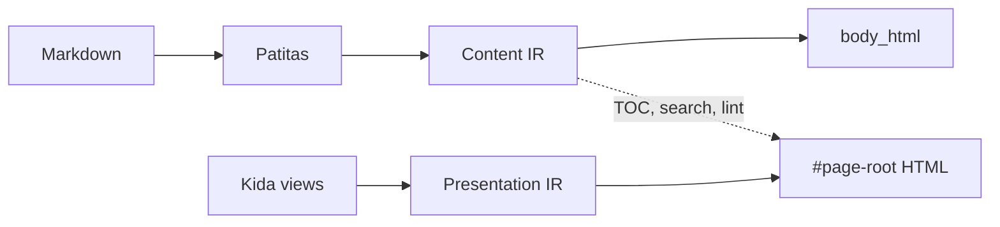

Furatena aligns two intermediate representations:

**Content IR** captures headings, links, and directives at index time. **Presentation IR**
captures view template blocks and context contracts.

The catalog graph connects them — TOC, backlinks, lint, incremental reload, and agent
queries read structure instead of scraping HTML.

See the design doc [Dual IR](https://github.com/lbliii/furatena/blob/main/docs/DUAL_IR.md) in the repository.
