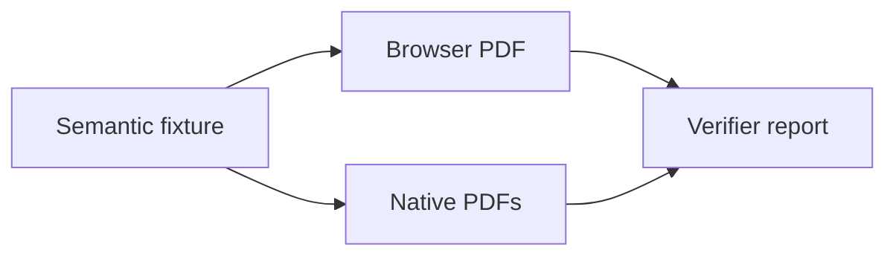

# Cross-head PDF publication proof

`FURA_PDF_PUBLIC_SENTINEL_434`

This page is the shared semantic fixture for the browser-print and native PDF heads. It
deliberately combines long prose, nested structure, links, code, tables, figures, and
interactive disclosure components so a pleasant first page cannot conceal failures on
later pages. The title and canonical URL of this hosted page are also captured as proof
provenance.

The prose includes **strong importance**, *emphasis*, `inline code`, and a visible URL:
<https://example.com/already-visible>. It also includes an [internal link](/docs/), a
[clean external link](https://example.com/reference), and a
[tracked external link](https://example.com/reference?utm_source=pdf-proof&utm_campaign=434).

## Long prose and hierarchy

### Why late pages matter

Publication defects often appear only after a page break. A dark application shell can
leak into print, a white foreground token can survive after the background is reset, and
an avoid-break rule can push a large block onto an otherwise empty final sheet. The proof
therefore repeats enough meaningful prose to cross page boundaries while retaining clear
headings and paragraphs for outline and structure inspection.

Furatena treats a PDF as a publication artifact rather than a screenshot. Reviewers need
searchable text, meaningful document navigation, working annotations, stable metadata,
and visible content on every page. Automation must be able to distinguish a genuinely
short final page from a pagination bug, and it must report the actual number of sheets in
the file rather than the number of catalog nodes selected for export.

#### Fourth-level heading

The fourth-level heading ensures the browser outline preserves more than a flat list. The
paragraph beneath it gives the heading enough nearby text to make visual hierarchy clear
in both rendering heads.

## Code stress

Short code remains together and readable:

```python
def publication_status(*, tagged: bool, links: int) -> str:
    return "ready" if tagged and links > 0 else "needs-evidence"
```

The next block is intentionally tall and contains a long unbroken token. It must wrap or
clip safely without painting outside the page box.

```text
proof-token=FURATENA_PDF_ABCDEFGHIJKLMNOPQRSTUVWXYZ0123456789ABCDEFGHIJKLMNOPQRSTUVWXYZ0123456789ABCDEFGHIJKLMNOPQRSTUVWXYZ0123456789_END
01 load semantic fixture
02 resolve public projection
03 render heading tree
04 render paragraph styles
05 render inline emphasis
06 render external annotations
07 render internal annotations
08 render short code block
09 render tall code block
10 render long unbroken token
11 render compact table
12 repeat table headers
13 render nested list
14 render callout
15 render figure
16 render diagram fallback
17 render tabs
18 render disclosure
19 render badges
20 render custom cards
21 record canonical URL
22 record PDF title
23 record page count
24 record outline count
25 record annotation count
26 record tagged status
27 record structure types
28 extract searchable text
29 assert public sentinel
30 reject protected sentinel
31 rasterize every page
32 measure dark backgrounds
33 measure visible ink
34 measure page edges
35 detect blank final page
36 compare reported page count
37 write JSON report
38 write Markdown summary
39 upload native PDFs
40 upload browser PDF
41 upload raster pages
42 upload verifier report
43 verify hosted page
44 preserve deterministic names
45 finish proof corpus
```

## Table stress

| Artifact | Required evidence | Failure caught |
|---|---|---|
| Browser PDF | Tags, outline, annotations, text, and rasters | Mixed theme or white-on-white pages |
| Native page PDF | Actual page count and semantic diagnostics | One selected node reported as one PDF page |
| Native collection PDF | Shared fixture plus neighboring public proof pages | Collection selection or pagination drift |
| Native site PDF | Public projection only | Protected canary leakage |

The tall table below is long enough to exercise repeated headers in renderers that support
them.

| Check | Input | Expected result |
|---|---|---|
| 01 | title metadata | stable title |
| 02 | canonical metadata | hosted canonical URL |
| 03 | heading level one | document outline root |
| 04 | heading level two | outline child |
| 05 | heading level three | nested outline child |
| 06 | external link | link annotation |
| 07 | internal link | link annotation |
| 08 | visible URL | no duplicated tracking text |
| 09 | short code | intact block |
| 10 | tall code | clean page breaks |
| 11 | long token | no right-edge clipping |
| 12 | compact table | visible borders |
| 13 | tall table | repeated header |
| 14 | unordered list | visible markers |
| 15 | ordered list | stable numbering |
| 16 | nested list | visible hierarchy |
| 17 | callout | light printable surface |
| 18 | figure | bounded image |
| 19 | diagram | printable fallback |
| 20 | tabs | all relevant content represented |
| 21 | card | bounded printable content |
| 22 | public sentinel | present |
| 23 | protected sentinel | absent |
| 24 | final page | materially occupied |

## Lists and callouts

1. Generate every head from the same catalog fixture.
2. Preserve nested meaning.
   - Inspect structure, not only extracted text.
   - Rasterize every page, not only the cover.
     - Flag dark backgrounds.
     - Flag low-ink text-bearing pages.
     - Flag content touching the page edge.
3. Keep all evidence together as one workflow artifact.

:::{warning}
The protected canary must never appear in public browser, page, collection, or site PDF
artifacts. A verifier that only checks the happy-path sentinel is incomplete.
:::

:::{tip}
The proof report is machine-readable JSON, while the short Markdown table is optimized for
pull-request review.
:::

## Figure and diagram




## Tabs, disclosure, badges, and cards

:::::{tabs}
::::{tab} Browser head

Chromium prints the hosted semantic page with tags and an outline enabled.

::::{/tab}
::::{tab} Native head

The native page, collection, and site scopes are generated from the same catalog.

::::{/tab}
:::::{/tabs}

:::{dropdown} Inspect the proof rule
Every PDF, every raster page, and the verifier report are uploaded together.
:::

`proof:deterministic` `channel:pdf` `issue:434`

:::{cards}
:::{card} Structural evidence

Metadata, outlines, annotations, tags, extracted text, and structure-tree diagnostics.

:::{/card}
:::{card} Visual evidence

Raster metrics for backgrounds, low-contrast pages, clipping, and blank final sheets.

:::{/card}
:::{/cards}

## Final occupied section

This final section intentionally contains substantive text so an extra mostly blank sheet
is unambiguously a defect. The proof is complete only when this paragraph, the public
sentinel, and the preceding semantic structures remain searchable and visibly rendered.
